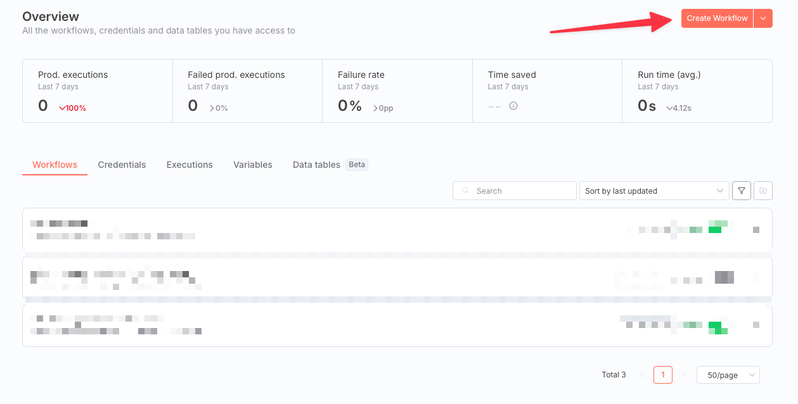
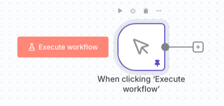
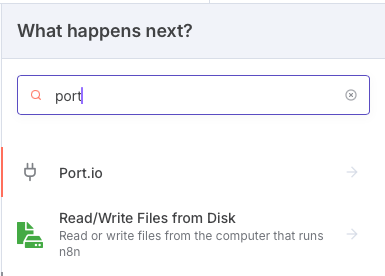
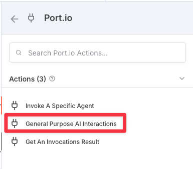
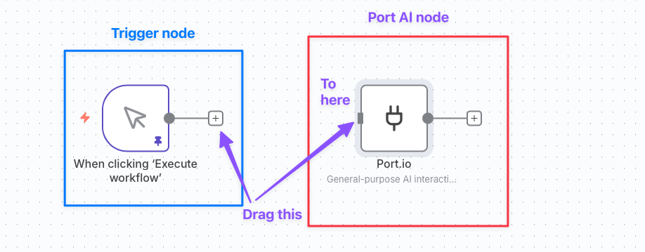
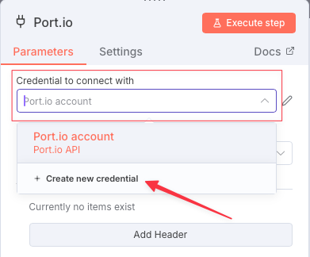
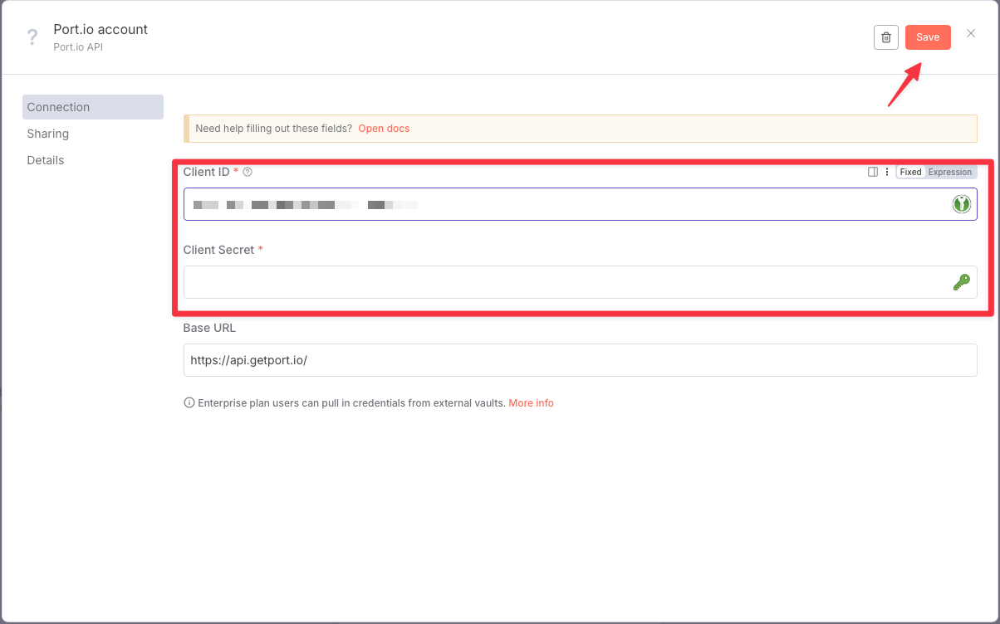
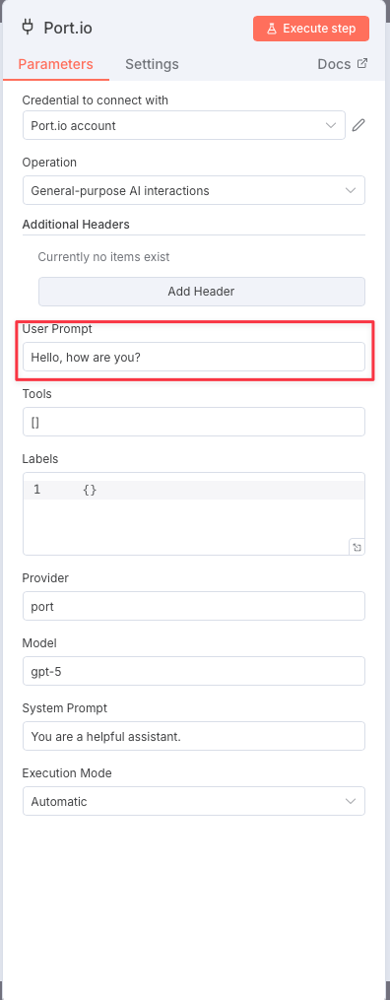
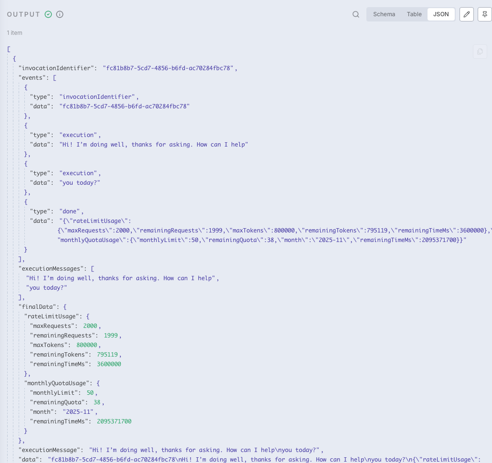

# 🧩 @port-labs/n8n-nodes-portio-experimental

> **Port.io** n8n custom nodes for interacting with [Port](https://www.port.io/) via n8n workflows.

As of **November 2025**, the focus of this package is on **AI interactions** through Port’s AI APIs. Future releases will expand to additional REST integrations and workflow automations, enabling n8n and Port users to connect multiple tools seamlessly. **This is an experimental package, no support can be provided
in relation to your use of this package, if you've found a bug or need a feature currently not supported, open a GitHub issue**,

---

## 🚀 Installation

### Option 1 — Install via npm (recommended)

You can install the package directly from npm:

```bash
npm install @port-labs/n8n-nodes-portio-experimental
```

or using **pnpm**:

```bash
pnpm add @port-labs/n8n-nodes-portio-experimental
```

> [!NOTE]  
> When installed this way, the nodes will be available in your n8n instance once you configure n8n to load community nodes. To enable this you must set the environment variable `N8N_COMMUNITY_PACKAGES_ENABLED=true` and install the npm packages in N8N_HOME.

---

### Option 2 — Local installation (development or custom build)

#### Prerequisites

- 🧱 A working **n8n** instance (see [this quick-start guide](https://medium.com/@learning.by.playing.2023/getting-started-n8n-with-dockercompose-eb602aaed5c0) for setup via Docker Compose)
- 📦 `pnpm` installed globally (`npm install -g pnpm`)

#### Steps

1. Clone this repository inside your n8n custom nodes directory:

   ```bash
   mkdir -p ./n8n-data/custom
   cd ./n8n-data/custom
   git clone https://github.com/port-labs/n8n-nodes-portio-experimental.git
   cd n8n-nodes-portio-experimental
   ```

2. Install dependencies and build the TypeScript source:

   ```bash
   pnpm install
   pnpm build
   ```

3. If the build completes successfully, you’ll see a new `dist` directory containing the compiled nodes.

---

## 🧭 Quick Start

### Adding a Port node in n8n

1. Create a new workflow in your running n8n instance.  
   

2. Set the trigger to **“Manual Trigger”** so you can execute it by clicking.  
   

3. Add a new node (`+` button) and search for `port`.  
   

4. Select the **Port.io** node and choose **“General Purpose AI Interaction”**.  
   

5. Connect the trigger node to the Port node.  
   

🎉 You’ve just deployed your first Port n8n node!

---

## 🔐 Adding Your Port Account

You can store multiple Port credentials in n8n, but we’ll start with one.

### Requirements

- A **Port.io** account with **AI features enabled**
- Your **Client ID** and **Client Secret** (see [Port API guide](https://docs.port.io/build-your-software-catalog/custom-integration/api/))

### Steps

1. Double-click your Port node.  
2. Under **“Credential to connect with”**, choose “Create new credential.”  
   
3. Enter your Port `client_id` and `client_secret`, then click **Save**.  
   

> [!NOTE]  
> JWT authentication is currently not supported because it’s unsuitable for long-term credential storage. OAuth2 credentials are the recommended method.

---

## 🧠 Running the Node

Before execution, ensure:

- You have a **Manual Trigger** connected to a **Port node**  
- Credentials are saved  
- Your Port account has **AI features enabled**

Then:

1. Open your AI node and configure the parameters (for example, set a user prompt).  
   

2. Execute the workflow manually and inspect the node output.  
   

✅ If successful, you’ll see an AI response from Port ready to be passed to subsequent nodes.

---

## ⚙️ API Endpoints Implemented

> [!NOTE]  
> As of November 2025, only **AI prompt** endpoints are supported. Contributions for additional API paths are welcome.

| Method | Path | Purpose | Path Params | Body (required) | Optional Params | Notes | Success Response |
|---|---|---|---|---|---|---|---|
| `POST` | `/v1/agent/:agentIdentifier/invoke` | Invoke a specific agent | `agentIdentifier` | — | `context`, `prompt`, `labels`, `provider`, `model` | Providers: `openai` \| `azure-openai` \| `anthropic` \| `bedrock` \| `port` <br> Models: `gpt-5` \| `claude-sonnet-4-20250514` | JSON agent result |
| `POST` | `/v1/ai/invoke` | General-purpose AI interaction | — | `invocation_identifier`, `userPrompt`, `tools` | `labels`, `provider`, `model`, `systemPrompt`, `executionMode` | Execution mode: `Automatic` \| `Approval Required` | JSON result |
| `GET` | `/v1/ai/invoke/:invocation_identifier` | Fetch invocation result | `invocation_identifier` | — | — | — | `{ ok: boolean, result: object }` |

---

## 🤝 Contributing

Contributions are welcome!

1. Fork the repo  
2. Create a new branch (`feat/awesome-thing`)  
3. Make your changes  
4. Submit a PR with a clear description of your update  

Please include tests and examples when possible.

---

## 🪪 License

MIT © [Port Labs](https://www.port.io)

---

## 📦 Example Usage (code)

```javascript
// Example: Calling a Port AI node programmatically via n8n API

const axios = require('axios');

const res = await axios.post('https://n8n.local/api/v1/workflows/1/execute', {
  userPrompt: 'Summarize this README for me!',
  provider: 'openai',
  model: 'gpt-5'
});

console.log(res.data);
```

---

## 🏷️ Metadata

| Field | Value |
|---|---|
| **Package name** | `@port-labs/n8n-nodes-portio-experimental` |
| **Version** | `1.0.0-alpha.5` (experimental release) |
| **Node type** | Custom n8n nodes |
| **Focus** | Port AI integrations |
| **Status** | Experimental / early access |
